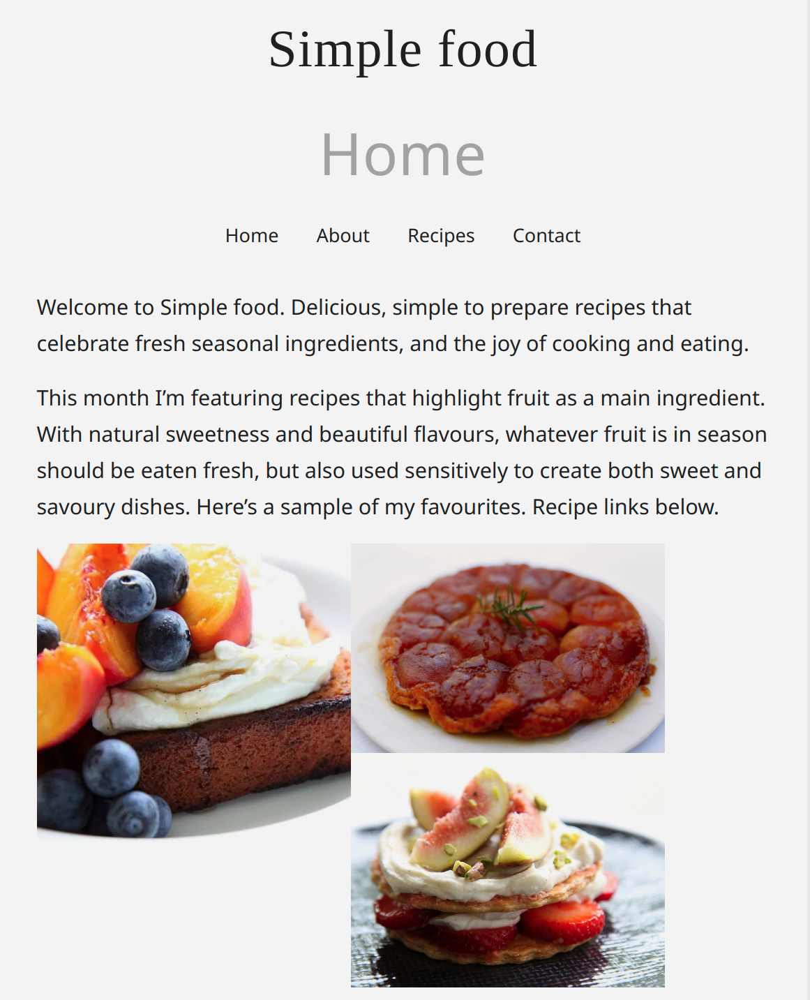

# SimpleFood.blog 🍲

A simple food blog website built as part of the **MERN Stack Full-Stack Development Course**. This project is a work in progress. Currently, only the **Home Page** is implemented.

## 📖 Project Overview

**SimpleFood.blog** is designed to be a minimalistic food blogging platform where users can share recipes, food stories, and cooking tips. The main goal of this project is to practice full-stack development using the MERN stack (MongoDB, Express, React, and Node.js).

> 🔧 **Note:** This is an educational project. So far, only the homepage is developed.

## 🖥️ Technologies Used

- **Frontend**:
  - HTML5
  - CSS3

## Screenshot

## Author

- **23BEC0192**
